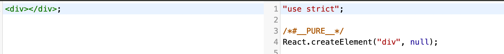
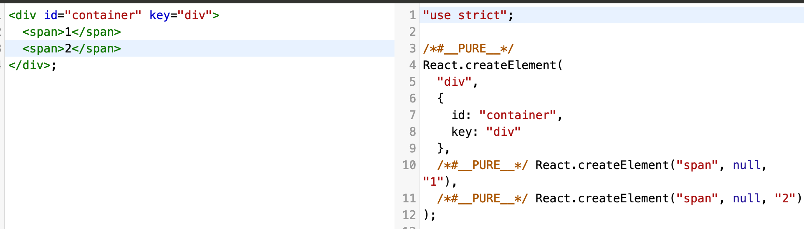
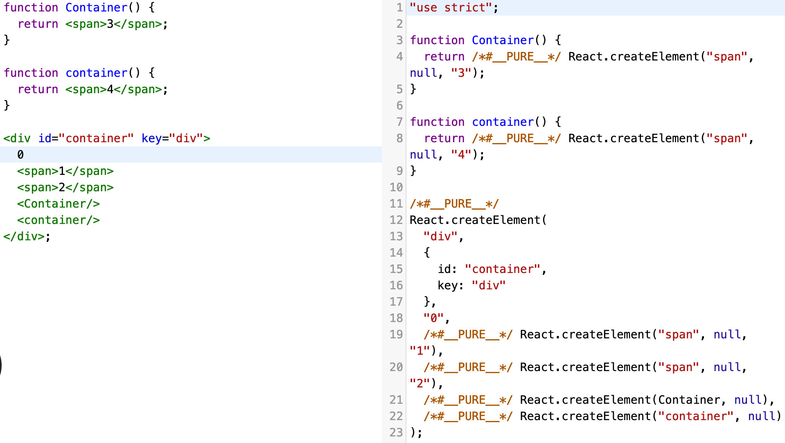

# 从 JSX 开始

跟着前面的一系列操作，此时环境已经问题已经处理好了，接下来从 JSX 入手。

## JSX 转 JavaScript 代码

其实很多做过 React 开发的多多少少都知道，JSX 代码最后会生成 `React.createElement` 调用形式的代码。
我们可以打开 Babel 的网站看看几个平常会使用到的 JSX 形式代码对应生成的 JS 代码长啥样。

[点击打开 Babel Try it out](https://babeljs.io/repl#?browsers=defaults%2C%20not%20ie%2011%2C%20not%20ie_mob%2011&build=&builtIns=false&corejs=3.21&spec=false&loose=false&code_lz=Q&debug=false&forceAllTransforms=false&shippedProposals=false&circleciRepo=&evaluate=false&fileSize=false&timeTravel=false&sourceType=module&lineWrap=true&presets=env%2Creact%2Cstage-2&prettier=true&targets=Node-16.9&version=7.19.2&externalPlugins=&assumptions=%7B%7D)  
随便输入点东西个 `div` 标签，然后就可以看到如图所示转译后的代码


然后给 `div` 加上一两个属性，同时加上子节点，于是就变成了这样



然后再写上组件嵌套的代码



看到这些生成的代码，其实可以稍微总结一下了，普通标签直接生成 `React.createElement` 调用，
其第一个参数是一个字符串或 function/class 名，第二个参数表示的是标签的属性，一个可为 `null` 的对象，
第三个（含第三）之后的参数是子组件，如果直接在 JSX 里写非标签或组件外的内容，譬如图中的 0 这个数字，
生成的代码会把 `"0"` 作为一个子组件传进参数。看图中 22 行，如果 function/class 组件首字母是小写，就不会被解析成组件，
而是把它的名字生成字符串传进参数中，因为 React 会把它认为是一个原生 HTML 的标签名。

## 源码中的 createElement

现在直接定位到之前我们移到该项目下的 React 源码（`src/3rd-party/react/packages/react/src/React.js`），
然后我们就可以看到这些个代码，
这里分别从 `ReactElement.js` 跟 `ReactElementValidator.js` 两个文件引入了对应开发或生产环境的两个 `createElement` 函数。

```javascript
// ...
import {
  createElement as createElementProd,
  createFactory as createFactoryProd,
  cloneElement as cloneElementProd,
  isValidElement,
} from './ReactElement';

// ...
import {
  createElementWithValidation,
  createFactoryWithValidation,
  cloneElementWithValidation,
} from './ReactElementValidator';

// ...
const createElement = __DEV__ ? createElementWithValidation : createElementProd;
const cloneElement = __DEV__ ? cloneElementWithValidation : cloneElementProd;
const createFactory = __DEV__ ? createFactoryWithValidation : createFactoryProd;
```

通过 **IDE** 或者 **Editor** 进到对应的函数，瞥一眼会发觉 `createElementWithValidation` 主要是做了一堆校验，里面还是调用了 `ReactElement.js` 文件内的 `createElement`。

```javascript
export function createElementWithValidation(type, props, children) {
  // ...
  const element = createElement.apply(this, arguments);
  // ...
}
```

再跳转到 `createElement` 函数的定义，直接就跳到 `ReactElement.js` 这个文件来了，其他不重要，这个函数的参数，
跟我们通过 JSX 转译到的很像了，一个当前 element 的类型，一个 attributes 配置对象，还有一堆 children 子组件。
```javascript
const RESERVED_PROPS = {
  key: true,
  ref: true,
  __self: true,
  __source: true,
};

export function createElement(type, config, children) {
  let propName;

  // Reserved names are extracted
  const props = {};

  let key = null, ref = null, self = null, source = null; 
  if (config != null) {
    if (hasValidRef(config)) {
      ref = config.ref;
    }
    if (hasValidKey(config)) {
      key = '' + config.key;
    }

    self = config.__self === undefined ? null : config.__self;
    source = config.__source === undefined ? null : config.__source;
    // Remaining properties are added to a new props object
    for (propName in config) {
      if (
        hasOwnProperty.call(config, propName) &&
        !RESERVED_PROPS.hasOwnProperty(propName)
      ) {
        props[propName] = config[propName];
      }
    }
  }
  
  const childrenLength = arguments.length - 2;
  if (childrenLength === 1) {
    props.children = children;
  } else if (childrenLength > 1) {
    const childArray = Array(childrenLength);
    for (let i = 0; i < childrenLength; i++) {
      childArray[i] = arguments[i + 2];
    }
    props.children = childArray;
  }

  // Resolve default props
  if (type && type.defaultProps) {
    const defaultProps = type.defaultProps;
    for (propName in defaultProps) {
      if (props[propName] === undefined) {
        props[propName] = defaultProps[propName];
      }
    }
  }
  
  return ReactElement(
    type,
    key,
    ref,
    self,
    source,
    ReactCurrentOwner.current,
    props,
  );
}
```

然后就能看到它的逻辑，上面代码我把 `if (__DEV__) { // ... }` 这种 development 环境下的代码删掉了，
因为实际最终生成的生产环境代码是不存在 `if (__DEV__)` 内的逻辑，只是给开发环境下的代码兜个底。
现在我们可以看出，基本上它的逻辑是把当 config（attributes）对象不为 `null` 的时候，
把它的值抛开 `ref key __self __source` 这几个关键属性取出到一个 props 对象上，
利用函数内建的 arguments 把它的第三个参数（也就是 传给 createElement 的 children）取出来放到 props 的 children 属性上，
顺便处理了自定义组件的 defaultProps 默认属性。  
最终是返回一个 `ReactElement` 函数，把它的 `if (__DEV__) { // ... }` 片段删掉，就是下面显示的样子。
该函数返回一个 element，element 上有 `$$typeof type key ref props _owner` 这些属性。其中
`$$typeof` 的值是一个 `REACT_ELEMENT_TYPE` 常量，表明它的类型是一个 **React Element**。

```javascript
// src/3rd-party/react/packages/shared/ReactSymbols.js
export const REACT_ELEMENT_TYPE = Symbol.for('react.element');

const ReactElement = function(type, key, ref, self, source, owner, props) {
  const element = {
    // This tag allows us to uniquely identify this as a React Element
    $$typeof: REACT_ELEMENT_TYPE,

    // Built-in properties that belong on the element
    type: type,
    key: key,
    ref: ref,
    props: props,

    // Record the component responsible for creating this element.
    _owner: owner,
  };

  return element;
};
```

上面的函数有个 owner 的参数，我们看到其他调用的地方传入得是一个 `ReactCurrentOwner.current`，
定位到该对象看看它长啥样子，因为 React 用到了 flow 这个描述类型的工具，我们大概可以看懂这玩意是跟 fiber 有关的。
目前讯息有限，等后续了解了 fiber 应该就清楚它做了什么。

```javascript
const ReactCurrentOwner = {
  current: (null: null | Fiber),
};
```

----

目前大概了解了一下 React createElement 相关的几个函数，就目前掌握的讯息，还不太清楚 React 具体做了啥，只能等后续慢慢跟进了。
