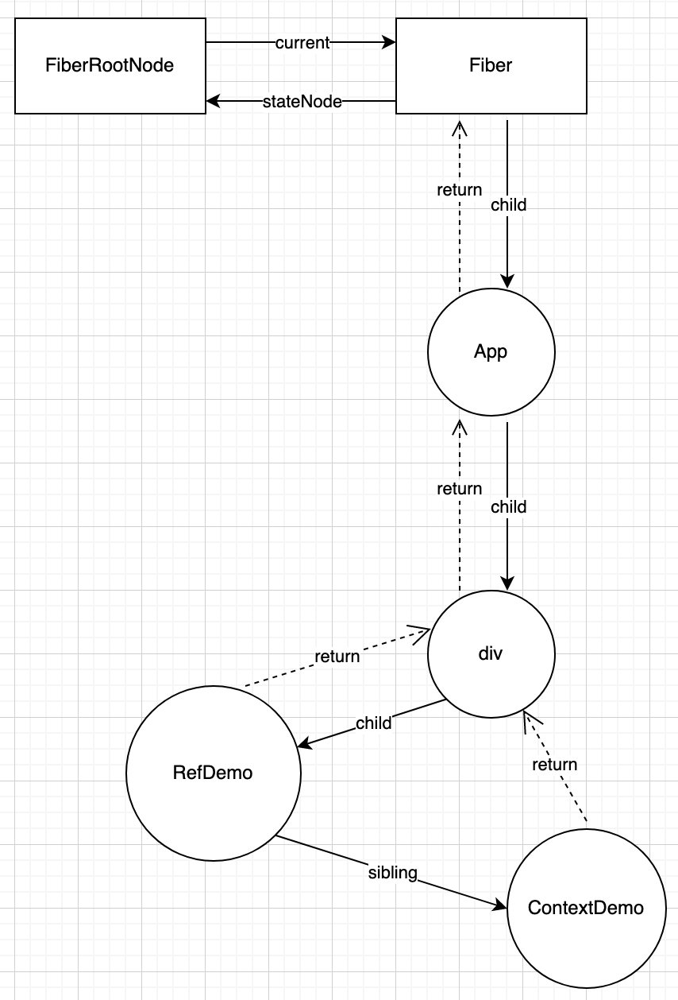

# React Fiber

上一节看了一下 ReactDOM 的源码，大概了解了怎么创建的根节点，可惜核心的 `createContainer` 跟 `updateContainer` 还没看。
不过我目前的猜想就是 `createContainer` 应该是生成一个 `fiber` 对象，
然后 `fiber` 对象里面持有一些状态，以及记录节点间的关系，
根据我写其他语言的经验，这家伙要是在 C 语言里就是个 context 性质的东西。  
希望打脸，我想看看 **React** 会不会颠覆一下我的认知。

## createContainer

先找到函数定义在哪，然后我通过开发工具直接定位到了 `src/3rd-party/react/packages/react-reconciler/src/ReactFiberReconciler.js`
文件，
然后就看它这家伙还判断了一下使用 **new/old** 模块的 `createContainer` 函数。找了一下发觉这个 `enableNewReconciler`
是 `false`。

```javascript
// src/3rd-party/react/packages/shared/ReactFeatureFlags.js
export const enableNewReconciler = false;

export const createContainer = enableNewReconciler
  ? createContainer_new
  : createContainer_old;
```

那就直接看 `createContainer_old` 函数的的内容。
打开文件 `src/3rd-party/react/packages/react-reconciler/src/ReactFiberReconciler.old.js`，
然后就找了这个函数，原来 `createContainer_old` 是 `createContainer` 的别名。

```javascript
export function createContainer(
  containerInfo: Container,
  tag: RootTag,
  hydrationCallbacks: null | SuspenseHydrationCallbacks,
  isStrictMode: boolean,
  concurrentUpdatesByDefaultOverride: null | boolean,
  identifierPrefix: string,
  onRecoverableError: (error: mixed) => void,
  transitionCallbacks: null | TransitionTracingCallbacks
): OpaqueRoot {
  const hydrate = false;
  const initialChildren = null;
  return createFiberRoot(
    containerInfo,
    tag,
    hydrate,
    initialChildren,
    hydrationCallbacks,
    isStrictMode,
    concurrentUpdatesByDefaultOverride,
    identifierPrefix,
    onRecoverableError,
    transitionCallbacks,
  );
}
```

该函数内部调用得是 `createFiberRoot`，同时也验证了一下我的猜想，`createContainer` 果然跟 `fiber` 有关。
接着跳转到 `src/3rd-party/react/packages/react-reconciler/src/ReactFiberRoot.old.js` 文件，
找到 `createFiberRoot` 函数。

```javascript
export function createFiberRoot(
  containerInfo: any,
  tag: RootTag,
  hydrate: boolean,
  initialChildren: ReactNodeList,
  hydrationCallbacks: null | SuspenseHydrationCallbacks,
  isStrictMode: boolean,
  concurrentUpdatesByDefaultOverride: null | boolean,
  // TODO: We have several of these arguments that are conceptually part of the
  // host config, but because they are passed in at runtime, we have to thread
  // them through the root constructor. Perhaps we should put them all into a
  // single type, like a DynamicHostConfig that is defined by the renderer.
  identifierPrefix: string,
  onRecoverableError: null | ((error: mixed) => void),
  transitionCallbacks: null | TransitionTracingCallbacks
): FiberRoot {
  const root: FiberRoot = (new FiberRootNode(
    containerInfo,
    tag,
    hydrate,
    identifierPrefix,
    onRecoverableError,
  ): any);
  if (enableSuspenseCallback) {
    root.hydrationCallbacks = hydrationCallbacks;
  }

  if (enableTransitionTracing) {
    root.transitionCallbacks = transitionCallbacks;
  }

  // Cyclic construction. This cheats the type system right now because
  // stateNode is any.
  const uninitializedFiber = createHostRootFiber(
    tag,
    isStrictMode,
    concurrentUpdatesByDefaultOverride,
  );
  root.current = uninitializedFiber;
  uninitializedFiber.stateNode = root;

  if (enableCache) {
    const initialCache = createCache();
    retainCache(initialCache);

    // The pooledCache is a fresh cache instance that is used temporarily
    // for newly mounted boundaries during a render. In general, the
    // pooledCache is always cleared from the root at the end of a render:
    // it is either released when render commits, or moved to an Offscreen
    // component if rendering suspends. Because the lifetime of the pooled
    // cache is distinct from the main memoizedState.cache, it must be
    // retained separately.
    root.pooledCache = initialCache;
    retainCache(initialCache);
    const initialState: RootState = {
      element: initialChildren,
      isDehydrated: hydrate,
      cache: initialCache,
      transitions: null,
      pendingSuspenseBoundaries: null,
    };
    uninitializedFiber.memoizedState = initialState;
  } else {
    const initialState: RootState = {
      element: initialChildren,
      isDehydrated: hydrate,
      cache: (null: any), // not enabled yet
      transitions: null,
      pendingSuspenseBoundaries: null,
    };
    uninitializedFiber.memoizedState = initialState;
  }

  initializeUpdateQueue(uninitializedFiber);

  return root;
}
```

可以看到先是 `new FiberRootNode()` 创建了个 `root` 对象。再通过 `createHostRootFiber` 给 `uninitializedFiber` 赋值，
顺便把 `uninitializedFiber` 引用传给 `root` 的 `current` 属性。
这个 `FiberRootNode` 构造函数长这样，果然看到有个 `current` 属性。
其他属性目前还看不明白，暂时先跳过。

```javascript
function FiberRootNode(
  containerInfo,
  tag,
  hydrate,
  identifierPrefix,
  onRecoverableError
) {
  this.tag = tag;
  this.containerInfo = containerInfo;
  this.pendingChildren = null;
  this.current = null;
  this.pingCache = null;
  this.finishedWork = null;
  this.timeoutHandle = noTimeout;
  this.context = null;
  this.pendingContext = null;
  this.callbackNode = null;
  this.callbackPriority = NoLane;
  this.eventTimes = createLaneMap(NoLanes);
  this.expirationTimes = createLaneMap(NoTimestamp);

  this.pendingLanes = NoLanes;
  this.suspendedLanes = NoLanes;
  this.pingedLanes = NoLanes;
  this.expiredLanes = NoLanes;
  this.mutableReadLanes = NoLanes;
  this.finishedLanes = NoLanes;

  this.entangledLanes = NoLanes;
  this.entanglements = createLaneMap(NoLanes);

  this.identifierPrefix = identifierPrefix;
  this.onRecoverableError = onRecoverableError;

  if (enableCache) {
    // ...
  }

  if (supportsHydration) {
    this.mutableSourceEagerHydrationData = null;
  }

  // src/3rd-party/react/packages/shared/ReactFeatureFlags.js
  // export const enableSuspenseCallback = false;
  // export const enableTransitionTracing = false;
  if (enableSuspenseCallback) {
    // ...
  }

  if (enableTransitionTracing) {
    // ...
  }

  if (enableProfilerTimer && enableProfilerCommitHooks) {
    // ...
  }

  if (enableUpdaterTracking) {
    // ...
  }

  if (__DEV__) {
    // ...
  }
}
```

至于这个 `uninitializedFiber` 就是一个 `fiber` 对象，这个对象有 `stateNode` 跟 `memoizedState` 属性。  
暂时不管这两属性干嘛的，先看看这个 `createHostRootFiber` 在做什么。

```javascript
// src/3rd-party/react/packages/react-reconciler/src/ReactRootTags.js
export const ConcurrentRoot = 1;
// src/3rd-party/react/packages/react-reconciler/src/ReactTypeOfMode.js
export const ConcurrentMode = /*                 */ 0b000001;
export const StrictLegacyMode = /*               */ 0b001000;
export const StrictEffectsMode = /*              */ 0b010000;
export const ConcurrentUpdatesByDefaultMode = /* */ 0b100000;

// src/3rd-party/react/packages/shared/ReactFeatureFlags.js
export const enableStrictEffects = __DEV__;
export const createRootStrictEffectsByDefault = false;
export const enableSyncDefaultUpdates = true;

export function createHostRootFiber(
  tag: RootTag,
  isStrictMode: boolean,
  concurrentUpdatesByDefaultOverride: null | boolean
): Fiber {
  let mode;
  if (tag === ConcurrentRoot) {
    mode = ConcurrentMode;
    if (isStrictMode === true) {
      mode |= StrictLegacyMode;

      if (enableStrictEffects) {
        mode |= StrictEffectsMode;
      }
    } else if (enableStrictEffects && createRootStrictEffectsByDefault) {
      mode |= StrictLegacyMode | StrictEffectsMode;
    }
    if (
      // We only use this flag for our repo tests to check both behaviors.
      // TODO: Flip this flag and rename it something like "forceConcurrentByDefaultForTesting"
      !enableSyncDefaultUpdates ||
      // Only for internal experiments.
      (allowConcurrentByDefault && concurrentUpdatesByDefaultOverride)
    ) {
      mode |= ConcurrentUpdatesByDefaultMode;
    }
  } else {
    mode = NoMode;
  }

  if (enableProfilerTimer && isDevToolsPresent) {
    // Always collect profile timings when DevTools are present.
    // This enables DevTools to start capturing timing at any point–
    // Without some nodes in the tree having empty base times.
    mode |= ProfileMode;
  }

  return createFiber(HostRoot, null, null, mode);
}
```

我们先预设一下当前环境，首先 `__DEV__` 的不看，然后其他条件不成立的也不看，
于是上面的代码就变成下面这种。

```javascript
// src/3rd-party/react/packages/react-reconciler/src/ReactWorkTags.js
export const HostRoot = 3; // Root of a host tree. Could be nested inside another node.
// src/3rd-party/react/packages/react-reconciler/src/ReactRootTags.js
export const ConcurrentRoot = 1;
// src/3rd-party/react/packages/react-reconciler/src/ReactTypeOfMode.js
export const NoMode = /*                         */ 0b000000;
export const ConcurrentMode = /*                 */ 0b000001;
export const StrictEffectsMode = /*              */ 0b010000;

export function createHostRootFiber(
  tag: RootTag,
  isStrictMode: boolean,
  concurrentUpdatesByDefaultOverride: null | boolean
): Fiber {
  let mode;
  if (tag === ConcurrentRoot) {
    mode = ConcurrentMode;
    if (isStrictMode === true) {
      mode |= StrictLegacyMode;
    }
  } else {
    mode = NoMode;
  }

  return createFiber(HostRoot, null, null, mode);
}
```

然后就发觉 `tag` 等于 `ConcurrentRoot` 时，在非严格模式下，`mode` 值就是 `1`，严格模式下，`mode` 值等于 `0b010001`，
完了再传给 `createFiber`，并标识当前 `fiber` 对象是 `HostRoot`，至此该 `fiber` 创建完成。  
然后再来看 `createFiber` 这个函数，因为明显 `createHostRootFiber` 是通过该函数返回最终创建的实例。
然后就看到一堆注释，说明了一下这个函数的注意点，想尝试使用数字 key 为了能在非 JIT 环境下优化（加上函数参数的类型标注，说明目前还是
string key）
，跟移植性相关的事宜（注释说容易用 C 语言表达）。

```javascript
// This is a constructor function, rather than a POJO constructor, still
// please ensure we do the following:
// 1) Nobody should add any instance methods on this. Instance methods can be
//    more difficult to predict when they get optimized and they are almost
//    never inlined properly in static compilers.
// 2) Nobody should rely on `instanceof Fiber` for type testing. We should
//    always know when it is a fiber.
// 3) We might want to experiment with using numeric keys since they are easier
//    to optimize in a non-JIT environment.
// 4) We can easily go from a constructor to a createFiber object literal if that
//    is faster.
// 5) It should be easy to port this to a C struct and keep a C implementation
//    compatible.
const createFiber = function (
  tag: WorkTag,
  pendingProps: mixed,
  key: null | string,
  mode: TypeOfMode
): Fiber {
  // $FlowFixMe: the shapes are exact here but Flow doesn't like constructors
  return new FiberNode(tag, pendingProps, key, mode);
};
```

继续进到 `FiberNode` 这个构造函数。

```javascript
function FiberNode(
  tag: WorkTag,
  pendingProps: mixed,
  key: null | string,
  mode: TypeOfMode
) {
  // Instance
  this.tag = tag;
  this.key = key;
  this.elementType = null;
  this.type = null;
  this.stateNode = null;

  // Fiber
  this.return = null;
  this.child = null;
  this.sibling = null;
  this.index = 0;

  this.ref = null;

  this.pendingProps = pendingProps;
  this.memoizedProps = null;
  this.updateQueue = null;
  this.memoizedState = null;
  this.dependencies = null;

  this.mode = mode;

  // Effects
  this.flags = NoFlags;
  this.subtreeFlags = NoFlags;
  this.deletions = null;

  this.lanes = NoLanes;
  this.childLanes = NoLanes;

  this.alternate = null;

  if (enableProfilerTimer) {
    // ...
  }

  if (__DEV__) {
    // ...
  }
}
```

### 总结 createContainer

代码看得差不多了，现在来总结一下 `createContainer` 调用链。
先是开发者会在外部调用 `createRoot`，`createRoot` 内部调用得是 `createContainer`，
`createContainer` 又调用了 `createFiberRoot`（也就是执行 `new FiberRootNode`）返回 `FiberRootNode` 实例，
其中 `FiberRootNode` 实例的 `current` 属性是 `createHostRootFiber` 后的 `Fiber` 实例，`Fiber` 实例，
`Fiber` 的 `stateNode` 属性又引用了 `FiberRootNode` 实例。

我们看代码的时候看到 `FiberRootNode` 有以下三个属性。

```javascript
this.return = null;
this.child = null;
this.sibling = null;
```

然后我通过在 `createFiberRoot` 打印 `root` 的方式，看了一下从 `FiberRootNode` 到整棵 tree 的关系。

```javascript
export function createFiberRoot(
  containerInfo: any,
  tag: RootTag,
  hydrate: boolean,
  initialChildren: ReactNodeList,
  hydrationCallbacks: null | SuspenseHydrationCallbacks,
  isStrictMode: boolean,
  concurrentUpdatesByDefaultOverride: null | boolean,
  identifierPrefix: string,
  onRecoverableError: null | ((error: mixed) => void),
  transitionCallbacks: null | TransitionTracingCallbacks
): FiberRoot {
  // ...
  console.log(root);
  return root;
}
```

`return` 表示得是该 `FiberNode` 上一级，`child` 不用解释，肯定是指当前节点的子节点，
`sibling` 也好理解，就是当前节点的相邻节点（所谓的兄弟节点）。  
然后再结合代码跟我们自己的理解，现在来描述一下当前工程 demo 的部分关系（图中每个圆表示一个 `FiberNode` 对象）。



## updateContainer

之前我们知道，`render` 函数其实最后执行得是 `updateContainer(children, root, null, null);`，根据之前的经验，
直接打开 `src/3rd-party/react/packages/react-reconciler/src/ReactFiberReconciler.old.js`，
然后就找到了 `updateContainer` 函数。
`parentComponent` 跟 `callback` 传得都是 `null`，很合理，毕竟当前是 `FiberRoot`。
然后下面的逻辑就是引用 `container.current`，目前 `current` 就是 `FiberRootNode` 的 `current` 属性，
通过给 `requestUpdateLane` 函数传这个 `current` 来创建 `lane` 对象，目前还不清楚 `lane` 对象用来干什么的。

```javascript
export function updateContainer(
  element: ReactNodeList,
  container: OpaqueRoot,
  parentComponent: ?React$Component<any, any>,
  callback: ?Function
): Lane {
  if (__DEV__) {
    // ...
  }
  const current = container.current;
  const eventTime = requestEventTime();
  const lane = requestUpdateLane(current);

  if (enableSchedulingProfiler) {
    // ...
  }
  
  // const context = getContextForSubtree(parentComponent);
  // ...

  if (__DEV__) {
    // ...
  }
  
  // const update = createUpdate(eventTime, lane);
  // ...
  
// ...
  return lane;
}
```

`requestEventTime` 目前猜测应该是给后续计算过期时间用得，
因为 **React** 所谓的任务优先级，应该就是规定时间内没跑完就临时中断，
让优先级更高的先跑，既然如此，那肯定要知道从何时开始计时。  
然后看了一下 `requestEventTime` 函数实现，
然后一看 `if` 分支一般是第一步就获取当前时间（此处假设 **React** 自己实现得这个 now 就是取到当前真实时间）。
文件在 `src/3rd-party/react/packages/react-reconciler/src/ReactFiberWorkLoop.old.js`

```javascript
export const NoContext = /*             */ 0b000;
let executionContext: ExecutionContext = NoContext;
const RenderContext = /*                */ 0b010;
const CommitContext = /*                */ 0b100;

export function requestEventTime() {
  if ((executionContext & (RenderContext | CommitContext)) !== NoContext) {
    // We're inside React, so it's fine to read the actual time.
    return now();
  }
  // We're not inside React, so we may be in the middle of a browser event.
  if (currentEventTime !== NoTimestamp) {
    // Use the same start time for all updates until we enter React again.
    return currentEventTime;
  }
  // This is the first update since React yielded. Compute a new start time.
  currentEventTime = now();
  return currentEventTime;
}
```

然后就是 `context，`这一段可以跳过，因为我看了一下 `getContextForSubtree` 的实现，返回的是个 `emptyContextObject`，
原因是传进去的 `parentComponent` 是 `null`，目前没有深究的必要。

```javascript
export function updateContainer(
  element: ReactNodeList,
  container: OpaqueRoot,
  parentComponent: ?React$Component<any, any>,
  callback: ?Function
): Lane {
  // ...
  const context = getContextForSubtree(parentComponent);
  if (container.context === null) {
    container.context = context;
  } else {
    container.pendingContext = context;
  }
  // ...
  return lane;
}

// src/3rd-party/react/packages/react-reconciler/src/ReactFiberContext.old.js
export const emptyContextObject = {};

// src/3rd-party/react/packages/react-reconciler/src/ReactFiberReconciler.old.js
function getContextForSubtree(
  parentComponent: ?React$Component<any, any>
): Object {
  if (!parentComponent) {
    return emptyContextObject;
  }
  // ...
}
```

接着是 `createUpdate`，函数看着比较简单，就是返回一个 `update` 对象，应该是跟组件更新有关，后续再跟进一下。
`callback` 没啥好讲的，就是给 `update` 对象设置一下回调，顺便做了点防御性代码。

```javascript
// src/3rd-party/react/packages/react-reconciler/src/ReactFiberClassUpdateQueue.old.js
export function createUpdate(eventTime: number, lane: Lane): Update<*> {
  const update: Update<*> = {
    eventTime,
    lane,

    tag: UpdateState,
    payload: null,
    callback: null,

    next: null,
  };
  return update;
}

export function updateContainer(
  element: ReactNodeList,
  container: OpaqueRoot,
  parentComponent: ?React$Component<any, any>,
  callback: ?Function
): Lane {
  // ...
  const update = createUpdate(eventTime, lane);
  // Caution: React DevTools currently depends on this property
  // being called "element".
  update.payload = { element };

  callback = callback === undefined ? null : callback;
  if (callback !== null) {
    if (__DEV__) {
      // ...
    }
    update.callback = callback;
  }
  // ...
  return lane;
}
```

然后是 `enqueueUpdate` 函数，这玩意看着是跟更新队列有关的，猜测 **React** 的策略是把每个更新 task 传给一个队列，让它有序更新。

```javascript
export function updateContainer(
  element: ReactNodeList,
  container: OpaqueRoot,
  parentComponent: ?React$Component<any, any>,
  callback: ?Function
): Lane {
  // ...
  const root = enqueueUpdate(current, update, lane);
  if (root !== null) {
    scheduleUpdateOnFiber(root, current, lane, eventTime);
    entangleTransitions(root, current, lane);
  }
  
  return lane;
}
```

### 总结 updateContainer

首先是调用 `updateContainer` 时，会取出根节点的 `FiberNode`，所以讲更新操作其实是在跟 `Fiber` 对象打交道，然后先定个起始时间，
根据 `Fiber` 对象来分配 `lane`，创建了 `update` 对象，然后搞了一些瞎七搭八的东西，把 context 挂到容器（`FiberRootNode`）对象上，
把回调加到 update 上之类的操作，后面把更新子任务通过 `enqueueUpdate` 加到队列去，再调度更新。
还没看实际的更新操作，等后续再跟进。
